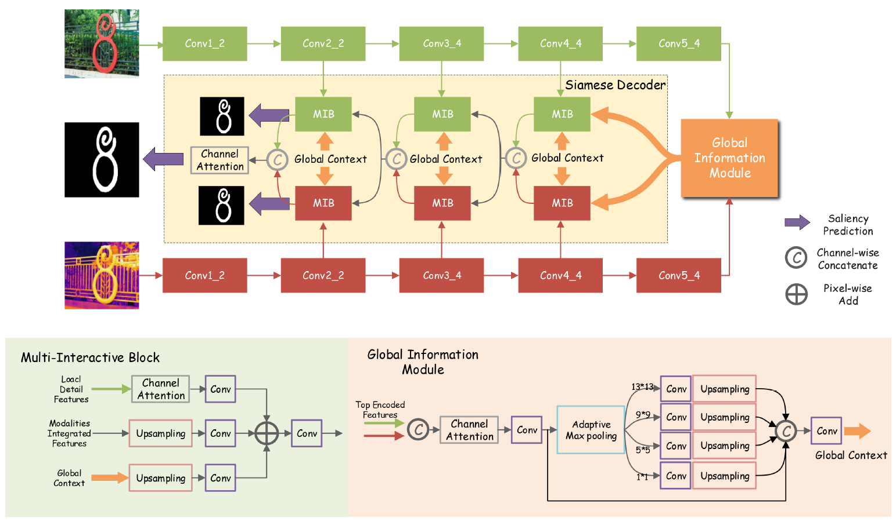

# Multi-interactive-Siamese-Decoder-for-RGBT-Salient-Object-Detection

The pytorch implementation of Multi-interactive Siamese Decoder for RGBT Salient Object Detection

## Train

- We use VT5000-Train to train our network. All the datasets are available in https://github.com/lz118/RGBT-Salient-Object-Detection
- The pretrained  model (VGG16) can be downloaded at https://pan.baidu.com/s/1GHX_-vMO9Po2s4TiDsRLGQ [nxdy]

## Test

- The trained models on RGB-T Dataset 

  https://pan.baidu.com/s/1Wj6bfi7lhp1KF5iCSVj0gQ [4zkx]

- The trained models on RGB-D Dataset 

  https://pan.baidu.com/s/1KlAKrVszQisG0bK1kiedzA [2ulc]

## Evalution

- For RGB-T SOD, we provide the our saliency maps on VT821, VT1000 and VT5000-Test. 

   https://pan.baidu.com/s/1MiqnoPOcw_sHkB0Yoo7IJQ  [5mnk]

- For RGB-D SOD, we provide the our saliency maps on SIP, SSD，STERE，LFSD and DES. 

  https://pan.baidu.com/s/1ZHxvMh818RxlZGW1hQA70w  [2oqx]

- The evalution toolbox is provided by https://github.com/jiwei0921/Saliency-Evaluation-Toolbox
